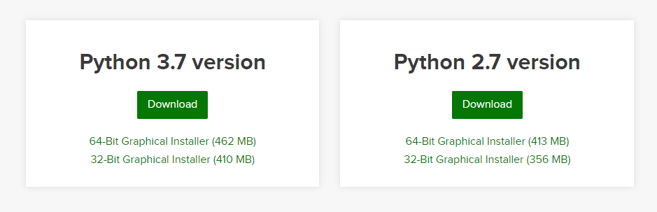

# Setup Keras with Anaconda

<h1>Download and Install anaconda</h1>
Download anaconda from this <a href = "https://www.anaconda.com/distribution/#download-section">link</a>.


Follow the instructions and install anaconda.

<h1>Create new conda environment</h1>

Create a new conda environment.

```
$ conda create --name keras python=3.7
```

Activate keras environment

```
$ conda activate keras
```

Install keras in new environment

```
(keras)$ conda install -c anaconda keras
```

<h1>Adding new environment to jupyter notebook</h1>

Run the following commands in the new conda environment.

```
(keras)$ python -m ipykernel install --user --name keras
```

<h2>NOTE</h2>
Refer to <a href = './files/conda_cheatsheet.pdf'>this</a> conda cheatsheet for additional conda commands.
